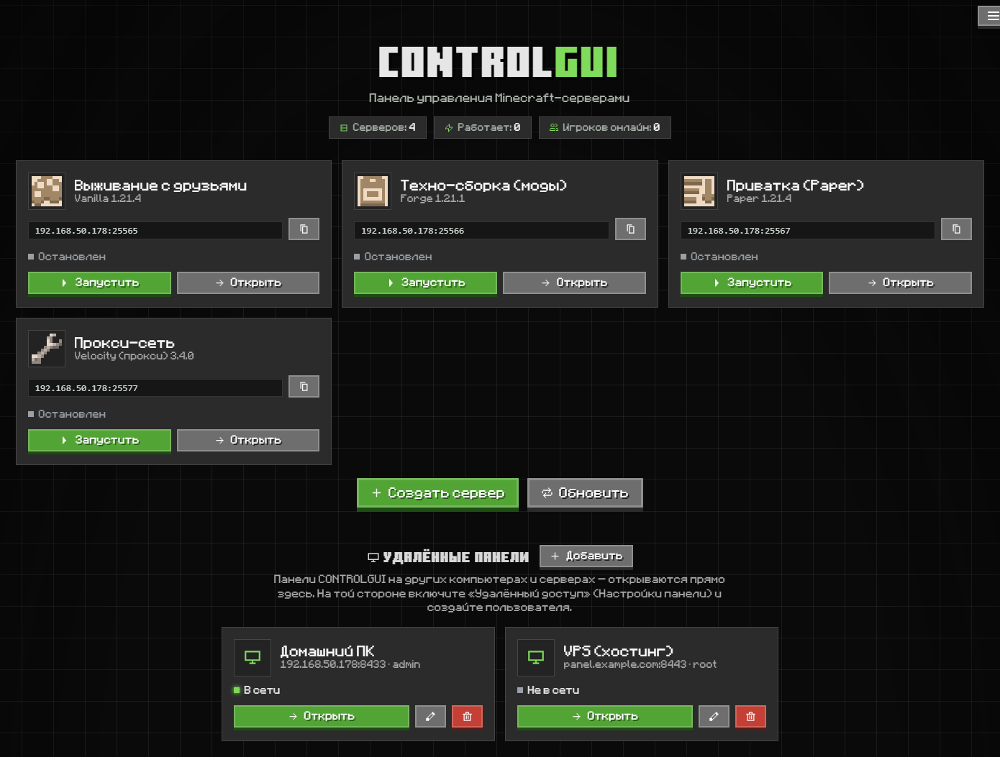
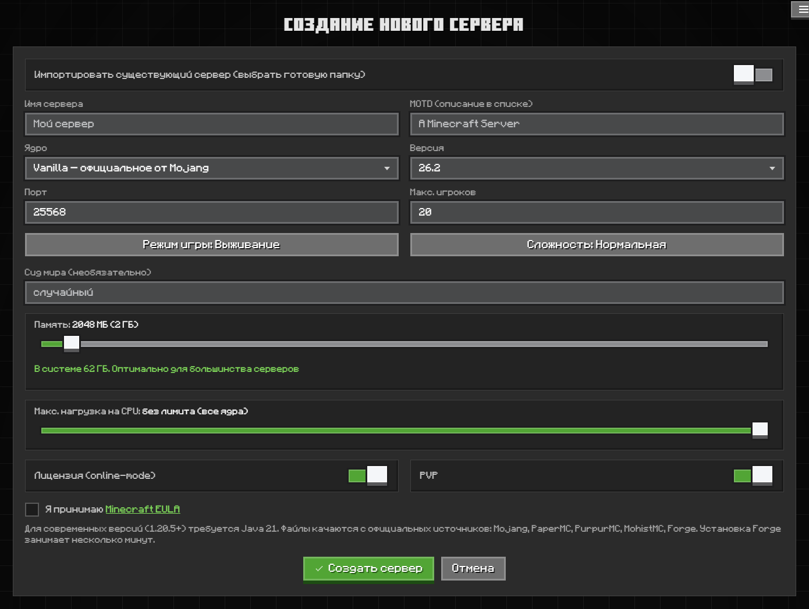
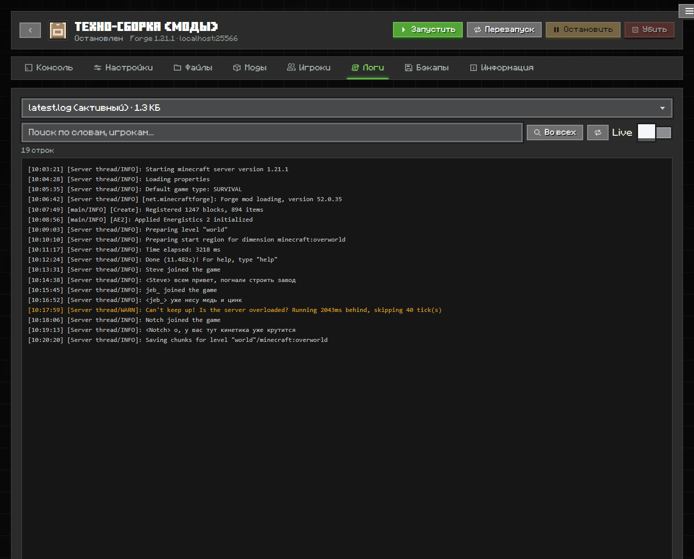
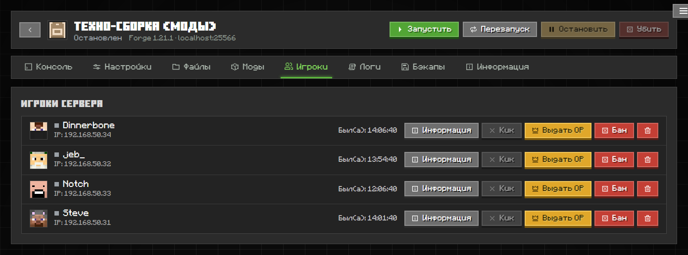
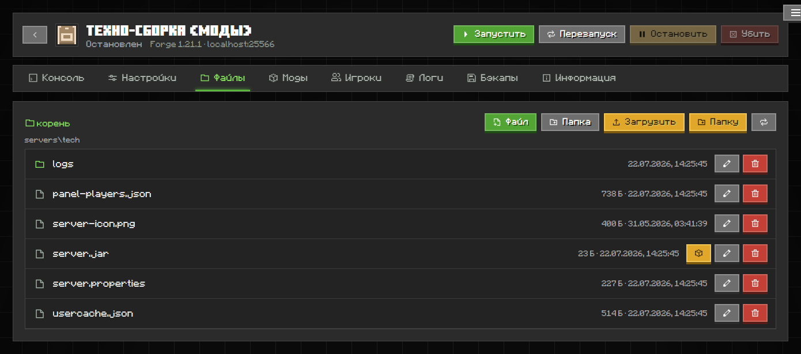
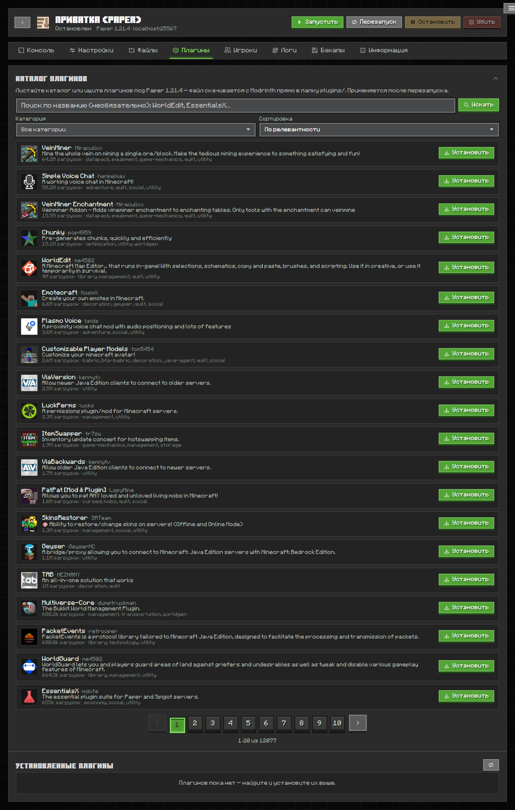
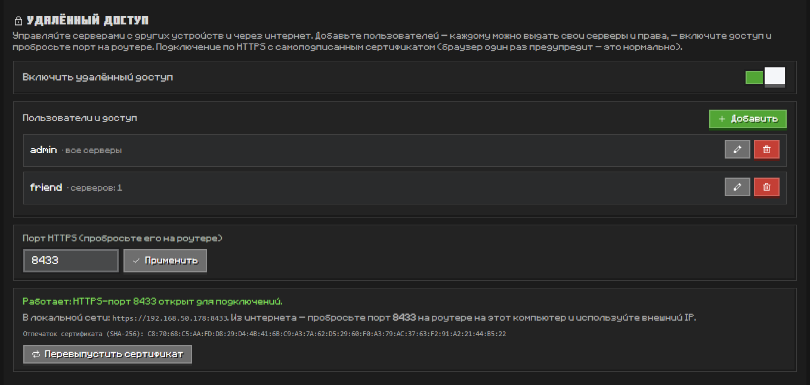
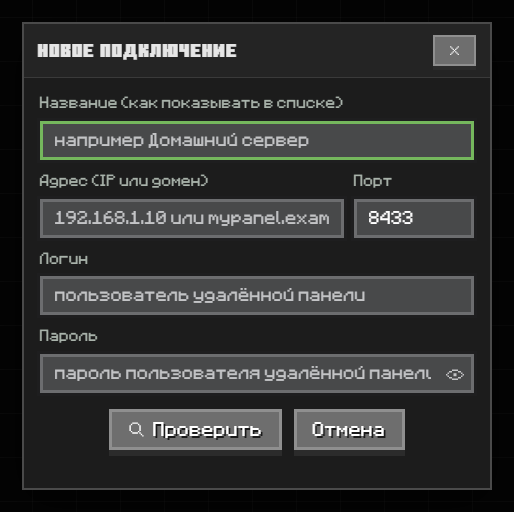

<div align="center">


# CONTROLGUI

### Настоящая панель управления Minecraft-серверами — на вашем компьютере

Без облаков, без аккаунтов, без npm-зависимостей. Один процесс Node.js, интерфейс в стиле Minecraft и полный контроль над серверами.

<br>

[](LICENSE)


**English version → [README.en.md](README.en.md)**

</div>

<br>

<div align="center">

</div>

<br>

CONTROLGUI поднимает и обслуживает **настоящие** серверы Minecraft — Vanilla, Paper, Purpur, Folia, Mohist, Forge и прокси Velocity / BungeeCord. Ядро и нужная Java скачиваются автоматически, а всё управление — консоль, файлы, игроки, моды, бэкапы — живёт в аккуратном веб-интерфейсе, который можно открыть как приложение или в браузере. Сервером является **только ваша машина** — никаких посредников.

---

## ✨ Возможности

- 🚀 **Сервер в два клика** — Vanilla, Paper, Purpur, Folia, Mohist, Forge + прокси Velocity / BungeeCord. Ядра качаются с официальных источников, нужная Java ставится сама на всех трёх ОС.
- 🖥️ **Живая консоль** с вводом команд и автоподсказками, графики CPU / RAM / диска и поиск по логам.
- 📂 **Файловый менеджер** со встроенным редактором кода, загрузкой файлов и целых папок, распаковкой zip/jar.
- 👥 **Игроки** — кто онлайн, просмотр и правка инвентаря и статов (свой NBT-парсер), кик / бан / OP / вайтлист.
- 🧩 **Моды и плагины** — встроенный каталог [Modrinth](https://modrinth.com): поиск, установка в один клик вместе с зависимостями, вкл/выкл.
- 💾 **Бэкапы** — создание, восстановление, скачивание.
- 🎨 **Ресурспаки** — загрузите пак, и панель сама раздаст его игрокам по локальной сети.
- 🌐 **Удалённый доступ** — несколько пользователей, у каждого свои серверы и права. HTTPS + пароль, порт на роутере — и управляйте откуда угодно.
- 🪟 **Удалённые панели** *(новое в 2.2.0)* — подключайтесь к CONTROLGUI на других машинах прямо из приложения.
- ⌨️ **Режим без GUI** — поставьте на Linux-VPS и рулите через браузер или текстовый интерфейс (TUI) прямо в SSH.

---

## 🚀 Создавайте серверы

Заполните форму — ядро и Java подтянутся сами. Память и лимит CPU настраиваются ползунками, режим игры и сложность — одной кнопкой. Есть импорт готовой папки сервера «на месте».

<div align="center">

</div>

---

## 🖥️ Консоль, логи и графики

Живая консоль с вводом команд и автодополнением, графики нагрузки по каждому серверу и полноценный просмотр логов с подсветкой и поиском — в том числе сразу по всем файлам.

<div align="center">

</div>

---

## 👥 Игроки и 📂 файлы

Список всех, кто заходил, с головами, IP и модерацией в один клик — кик, бан, OP, вайтлист, просмотр и правка инвентаря. Рядом — файловый менеджер со встроенным редактором кода.

<table>
<tr>
<td width="50%"></td>
<td width="50%"></td>
</tr>
</table>

---

## 🧩 Моды и плагины из каталога

Встроенный каталог [Modrinth](https://modrinth.com): ищите по названию и категории под версию и ядро вашего сервера, ставьте в один клик вместе с зависимостями прямо в `mods/` или `plugins/`.

<div align="center">

</div>

---

## 🌐 Удалённый доступ

Включите переключатель, добавьте пользователей (каждому — свои серверы и права), пробросьте один порт на роутере — и управляйте серверами откуда угодно по HTTPS. Сертификат самоподписанный и генерируется локально на чистом JS; приватный ключ не покидает вашу машину.

<div align="center">

</div>

**Как включить:**

1. **Меню → Настройки панели → Удалённый доступ** — добавьте пользователя, включите доступ (HTTPS-порт **8433** по умолчанию).
2. Пробросьте этот порт на роутере на свой компьютер.
3. Откуда угодно: `https://ваш-ip:8433` → браузер один раз предупредит о самоподписанном сертификате (сверьте показанный в панели SHA-256-отпечаток) → введите логин и пароль.

---

## 🪟 Удалённые панели *(новое в 2.2.0)*

Подключайтесь к панелям CONTROLGUI на **других компьютерах и серверах прямо из приложения** — без браузера. Добавьте адрес, порт, логин и пароль, сверьте отпечаток сертификата — и удалённая панель откроется в том же окне с автоматическим входом. Соединение защищено пиннингом сертификата, пароль не попадает в браузер.

<div align="center">

</div>

---

## 📦 Установка

Скачайте инсталлятор из [Releases](https://github.com/AlexFirst404/CONTROLGUI/releases):

| Платформа | Файл | Примечание |
|---|---|---|
| 🪟 **Windows** | `CONTROLGUI-<v>-windows-setup.exe` | Node.js встроен — ничего доустанавливать не нужно |
| 🍎 **macOS** (Apple Silicon) | `CONTROLGUI-<v>-macos-arm64.pkg` | Node.js встроен |
| 🐧 **Linux** (Debian/Ubuntu) | `controlgui_<v>_all.deb` | Нужен системный `nodejs` (≥ 18) |
| 🐧 **Linux** (любой дистрибутив) | `CONTROLGUI-<v>-x86_64.AppImage` | Node.js встроен |
| 🖥️ **Linux-сервер** (без GUI) | — | Одна команда, см. ниже ⬇️ |

### 🖥️ Linux-сервер без графики — в одну команду

```bash
git clone https://github.com/AlexFirst404/CONTROLGUI.git
cd CONTROLGUI
./install.sh
```

Установщик сам: проверит и **поставит Node.js** (apt/dnf/pacman/zypper/apk, иначе nvm), заведёт команду `controlgui`, спросит про **автозапуск (systemd)**, предложит **настроить удалённый доступ** прямо в терминале и запустит панель. Ничего доустанавливать руками не нужно.

Либо запустите из исходников вручную (любая ОС, Node.js ≥ 18, ноль npm-зависимостей):

```bash
git clone https://github.com/AlexFirst404/CONTROLGUI.git
cd CONTROLGUI
node server.js          # откройте http://localhost:8400
```

---

<details>
<summary><b>⌨️ CLI и Linux-сервер без GUI</b></summary>

<br>

```bash
./install.sh                        # установка на сервер: Node.js, автозапуск, удалёнка
controlgui serve                    # панель в этом терминале
controlgui start | stop | status    # панель фоном
controlgui remote setup             # ★ мастер удалённого доступа по шагам (в терминале)
controlgui remote user add <ник>    # добавить пользователя удалённого доступа
controlgui remote enable            # включить HTTPS-листенер (порт 8433)
sudo controlgui service install     # systemd-сервис с автозапуском
controlgui tui                      # текстовый интерфейс (работает и по HTTPS)
```

`controlgui remote setup` — интерактивный мастер прямо в SSH: создаёт пользователя (пароль без эха), спрашивает порт, включает HTTPS и **показывает отпечаток сертификата**, который нужно сверить при первом подключении клиента. Запущенная панель подхватывает изменения на лету — перезапуск не нужен.

TUI показывает серверы со статусом и CPU/RAM, умеет старт/стоп/рестарт и живую консоль с вводом команд — прямо в SSH-сессии. Подключение к удалённой панели: `controlgui tui https://ip:8433` (отпечаток сертификата пинится при первом входе и сверяется дальше).

</details>

<details>
<summary><b>🔒 Модель безопасности</b></summary>

<br>

- Обычный HTTP (порт 8400) отвечает **только на localhost** — из локальной сети доступна лишь раздача ресурспаков (`/rp/`).
- Изменяющие запросы к локальной панели принимаются только со **своего origin** (защита от CSRF).
- Удалённый доступ — отдельный HTTPS-листенер: пароли хешируются PBKDF2, сессии в HttpOnly-куках, защита от перебора (5 попыток → блок 5 минут), права **по каждому серверу** отдельно, сертификат генерируется локально.
- «Удалённые панели» ходят на ту сторону через локальный прокси с **пиннингом сертификата** и держат сессию в памяти — пароль и кука не попадают в браузер.
- Действия над самой машиной (закрыть приложение, системный выбор папки) для удалённых сессий запрещены.

</details>

<details>
<summary><b>🛠️ Устройство проекта и сборка</b></summary>

<br>

```
server.js          — входная точка (порт 8400; сменить: переменная PORT)
cli.js / tui.js    — CLI и текстовый интерфейс
lib/               — бэкенд: API, менеджер java-процессов, загрузчик, удалённый доступ
public/            — фронтенд: index.html, css/minecraft.css, js/
linux/ mac/        — сборка .deb / тарболла / AppImage / .pkg
```

- **Windows** — `dotnet publish` WPF-обёртки (WebView2) + скрипт Inno Setup.
- **Linux deb** — `node linux/build-deb.js` (сборщик .deb на чистом Node, без dpkg).
- **Linux тарболл** — `node linux/build-tarball.js`.
- **AppImage** — `linux/build-appimage.sh` (или workflow GitHub Actions).
- **macOS pkg** — `mac/build-pkg.sh` (или workflow GitHub Actions).

</details>

---

## 📄 Лицензия

[GPL-3.0](LICENSE) © AlexFirst

<sub>Интерфейс использует шрифты в стиле Minecraft, [Pixelarticons](https://pixelarticons.com/) (MIT), [Modrinth API](https://docs.modrinth.com/) для каталога модов, [mc-heads.net](https://mc-heads.net/) для голов игроков, текстуры предметов из [InventivetalentDev/minecraft-assets](https://github.com/InventivetalentDev/minecraft-assets) и [CodeMirror 5](https://codemirror.net/5/) (MIT) для редактора файлов. Скриншоты сделаны на демо-данных.</sub>
